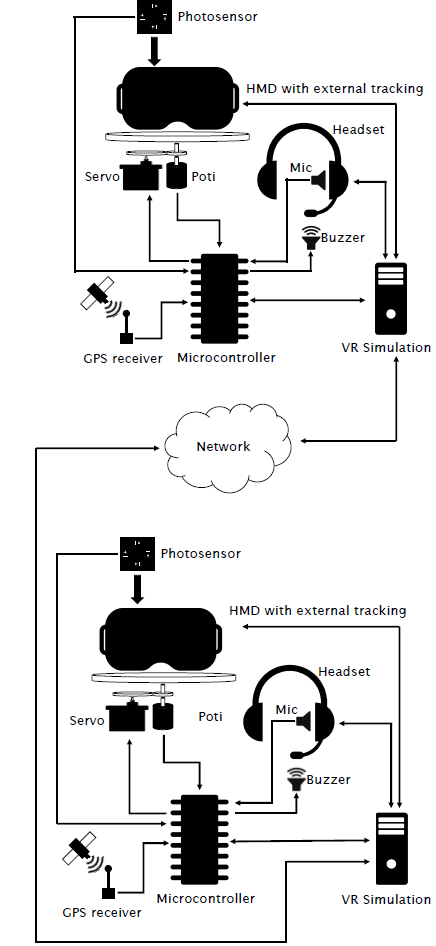

# VRLate
Tool to measure motion-to-photon and mouth-to-ear latency in distributed VR-Systems.

## Overview
Compared to existing measurement techniques, the described method is specifically designed for distributed VR systems. It will help to easily evaluate different setups in terms of motion-to-photon and mouth-to-ear latencies. The game-engine Unity 3D is used to simulate the virtual world. 
A quick overview of the used hardware and software of the measurement system will be given in the following two subsections.



### Motion-to-photon latency
Motion and the corresponding display output of a VR system are captured by a potentiometer and a photosensor which are both connected to a microcontroller. An object tracked by the VR system is mounted on the potentiometer and automatically rotated back and forth. The motion is controlled by a servo motor connected to the microcontroller. By monitoring the horizontal rotation with the potentiometer, it is possible to determine the rotary position of the real object at every interval.
To get the delay between the rotation of the real object and the corresponding display output, the latest angle captured by the motion-tracking system is presented on the VR display. 
The displayed value is converted into a brightness code so that it can be read with the microcontroller. By attaching the measurement unit’s photosensor to the display, it is possible to capture this brightness code and therefore the angle which was used by the VR system to render the current frame.
The perceived motion-to-photon latency is determined by comparing both signals with each other using cross-correlation.
### Mouth-to-ear latency
To determine the mouth-to-ear latency with the described measurement setup, a low-cost piezo buzzer and a microphone are used. Right before starting the measurement the microcontroller activates the buzzer for a short period of time. At every interval the microcontroller checks if the attached microphone detects any sound. Then, the mouth-to-ear latency can be determined by counting the intervals between the beginning of measurement and the received sound-impulse.
### Remote latency
If the delay between multiple VR systems needs to be measured, synchronization is required. In the presented method, GPS receivers are used to synchronize multiple microcontrollers and measure delays in distributed VR systems.

## Hardware


## Software

# Prerequisites
To run the VRLate program following programs need to be installed:
```
Arduino IDE (Tested with version 1.8.4)
Unity 3D (Tested with version 2017.1.1f1)
```

## License

This project is licensed under the MIT License - see the [LICENSE.md](LICENSE.md) file for details.
